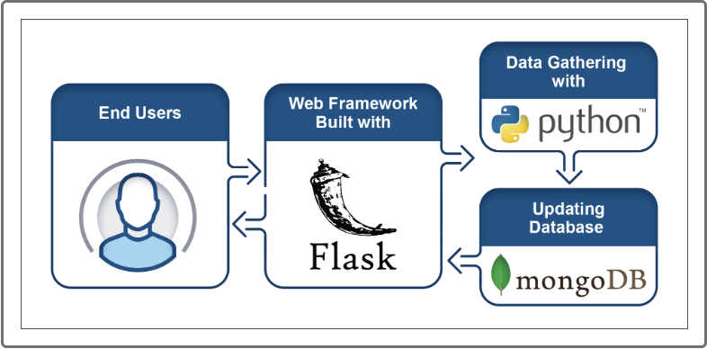
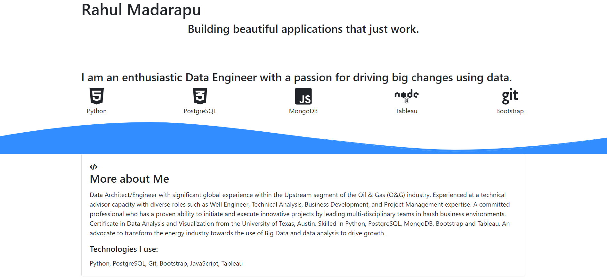

# Mission-to-Mars

## Background

A web scraping project was desired to keep up to date on the latest news and findings of Mars.  The end result is to gather all the information about the red planet from all over the web.

##  Tools and Technique Used

* Python
* Flask
* Bootstrap
* MongoDB
* BeautifulSoup
* Splinter
* ChromeDriver

Pull data from multiple websites, store it in a database, then present the collected data in a webpage.

A link to my portfolio showcasing my projects is below:
https://github.com/madarahr/portfolio.git

